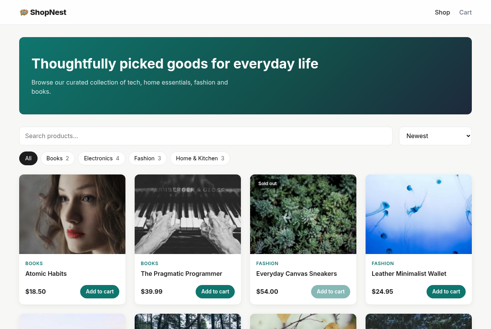
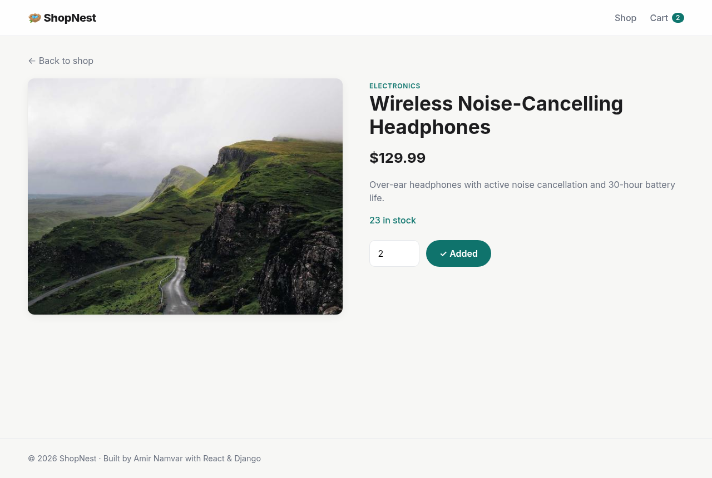
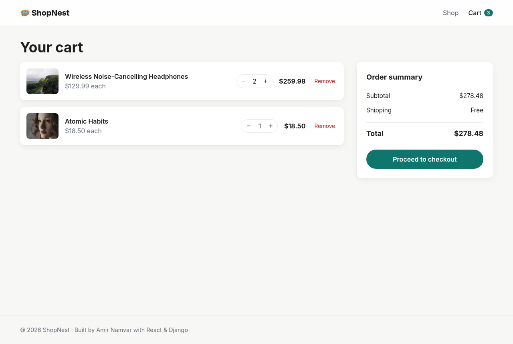

# 🪺 ShopNest

A clean, full-stack e-commerce store built with **React (Vite)** on the frontend and **Django + Django REST Framework** on the backend. Browse products by category, search the catalog, manage a persistent cart, and place orders through a REST API – with the Django admin for managing the catalog.

> Portfolio project by **Amir Namvar** – full-stack web developer.

---

## ✨ Features

- **Product catalog** – responsive product grid with category filters, debounced search and sorting (price / name / newest).
- **Shareable filters** – category, search and sort live in the URL query string.
- **Product detail pages** – images, description, stock status and quantity picker.
- **Shopping cart** – global React context + `useReducer`, persisted to `localStorage`, stock-aware quantity controls.
- **Checkout** – customer details form that creates an `Order` via the API.
- **Secure order logic** – prices are calculated server-side, stock is validated and decremented inside a database transaction (with row locking).
- **Django admin** – manage categories, products (inline-editable price / stock) and orders (with line items).
- **Seed command** – one command loads 4 categories and 12 demo products with placeholder images.
- **API tests** – Django test suite covering listing, filtering, detail and order creation.

## 🛠 Tech Stack

| Layer     | Technology |
|-----------|------------|
| Frontend  | React 19, React Router 7, Vite 7, plain CSS (custom properties) |
| Backend   | Python 3.10+, Django 5.2+, Django REST Framework, django-cors-headers |
| Database  | SQLite (zero configuration) |

## 📸 Screenshots

> _Screenshots live in `docs/screenshots/` – replace them with your own as the project evolves._

| Home | Product | Cart |
|------|---------|------|
|  |  |  |

## 🚀 Getting Started

### Prerequisites

- **Python** 3.10 or newer
- **Node.js** 20.19+ (or 22.12+) and npm

### 1. Clone the repository

```bash
git clone https://github.com/som-info/shopnest.git
cd shopnest
```

### 2. Backend (Django API)

```bash
cd backend
python -m venv .venv
source .venv/bin/activate          # Windows: .venv\Scripts\activate
pip install -r requirements.txt

python manage.py migrate
python manage.py seed_store        # load demo categories & products
python manage.py createsuperuser   # optional – for the admin panel
python manage.py runserver         # http://127.0.0.1:8000
```

- API root: <http://127.0.0.1:8000/api/>
- Admin panel: <http://127.0.0.1:8000/admin/>

Run the tests with:

```bash
python manage.py test
```

### 3. Frontend (React)

In a second terminal:

```bash
cd frontend
npm install
npm run dev                        # http://localhost:5173
```

In development, Vite proxies every `/api` request to `http://127.0.0.1:8000`, so no extra configuration is needed.

To build for production:

```bash
npm run build                      # outputs to frontend/dist
```

If the API is hosted on a different domain, copy `.env.example` to `.env` and set `VITE_API_URL` (e.g. `https://api.example.com`).

### Environment variables (backend)

| Variable               | Default                                       | Description |
|------------------------|-----------------------------------------------|-------------|
| `DJANGO_SECRET_KEY`    | dev-only placeholder                          | **Set this in production.** |
| `DJANGO_DEBUG`         | `true`                                        | Set to `false` in production. |
| `DJANGO_ALLOWED_HOSTS` | `localhost,127.0.0.1`                         | Comma-separated hostnames. |
| `CORS_ALLOWED_ORIGINS` | `http://localhost:5173,http://127.0.0.1:5173` | Origins allowed to call the API. |

## 🔌 API Reference

| Method | Endpoint                   | Description |
|--------|----------------------------|-------------|
| GET    | `/api/categories/`         | List categories with product counts |
| GET    | `/api/products/`           | List products. Query params: `category` (slug), `search`, `ordering` (`price`, `-price`, `name`, `-name`, `created_at`, `-created_at`) |
| GET    | `/api/products/<slug>/`    | Product detail |
| POST   | `/api/orders/`             | Create an order |

Example order payload:

```json
{
  "full_name": "Jane Doe",
  "email": "jane@example.com",
  "address": "1 Main Street",
  "city": "Springfield",
  "postal_code": "12345",
  "items": [{ "product_id": 1, "quantity": 2 }]
}
```

## 📁 Project Structure

```
shopnest/
├── backend/
│   ├── config/                 # Django project (settings, urls, wsgi/asgi)
│   ├── store/                  # Store app
│   │   ├── management/commands/seed_store.py   # demo data command
│   │   ├── migrations/
│   │   ├── admin.py            # admin configuration
│   │   ├── models.py           # Category, Product, Order, OrderItem
│   │   ├── serializers.py      # DRF serializers (order creation logic)
│   │   ├── tests.py            # API tests
│   │   ├── urls.py
│   │   └── views.py            # API views
│   ├── manage.py
│   └── requirements.txt
├── frontend/
│   ├── src/
│   │   ├── api/client.js       # fetch wrapper for the API
│   │   ├── components/         # Header, Footer, ProductCard, status helpers
│   │   ├── context/CartContext.jsx   # cart state + localStorage persistence
│   │   ├── pages/              # Home, Product, Cart, Checkout, OrderSuccess, NotFound
│   │   ├── App.jsx             # routes
│   │   ├── index.css           # global styles
│   │   └── main.jsx
│   ├── index.html
│   ├── package.json
│   └── vite.config.js
├── docs/screenshots/
├── LICENSE
└── README.md
```

## 🗺 Possible Improvements

- User accounts and order history
- Payment gateway integration (e.g. Stripe)
- Pagination and product reviews
- Docker Compose setup

## 📄 License

This project is licensed under the [MIT License](LICENSE).

---

Made with ❤️ by [Amir Namvar](https://github.com/som-info)
